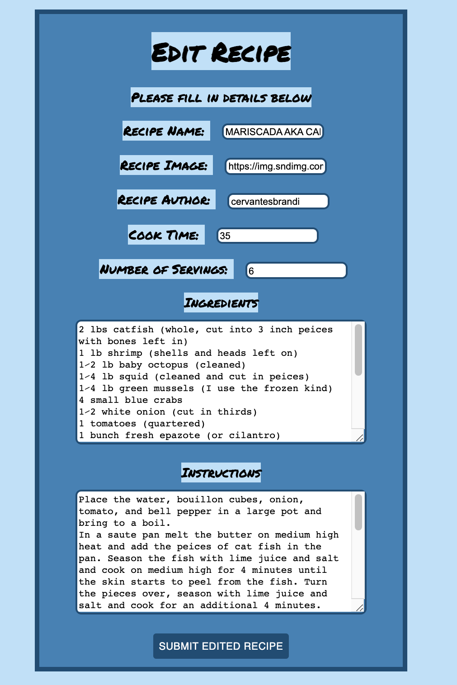

Project Name
====
Meel Reel

Description
===
This is an app to easily navigate, find and try new recipes. The recipes can easily be saved and favorited to easily be accessed for future use. The user can take the more traditional route and search by terms and return a plethora of ideas or they can generate a random recipe if they would like to try something random and new. In the details of each recipe, they should be able to find a picture, ingredients, details and a short instructional video of how to prepare their recipe. Also in the details page they will be able add the recipe to their save to try list if they would like to access it at a further date or favorite it if they tried the recipe and liked it.

Technologies Used
===
React
Redux
Redux-Saga
Node
Express
PostgreSQL
Tasty API (3rd Party API)

Visual Examples
===

Wireframes
---

Pages
---

